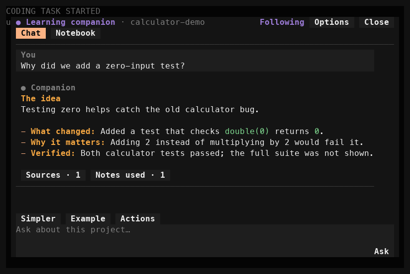
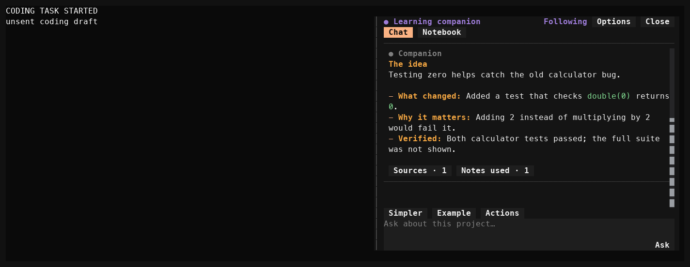
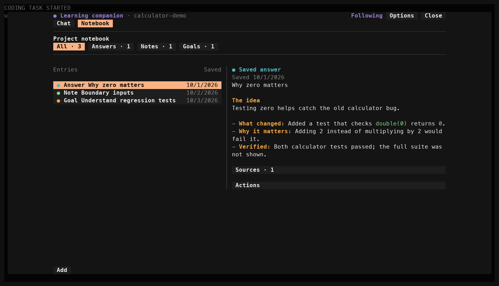

# User Guide

This guide explains the features this team added to opencode and how to try each one yourself. Each section below is written by whoever implemented that feature — add your own section rather than editing someone else's.

## Learning Recap (#5, #7–#11)

**What it does:** after opencode successfully finishes a task that changed files or ran tests, it appends one "Learning Recap" to the end of its final response, listing:

- **Files changed** — every file touched during the task, with its status (added/modified/deleted) and line counts.
- **Tests** — every test command that ran (`bun test`, `npm test`, `pytest`, `go test`, and similar), whether it passed, failed, or didn't finish, plus a short summary line.

Each recap covers all provider turns in the task, including work before instructions sent while opencode is busy. An empty category shows "No files were changed during this task." or "No tests were run during this task." Plain replies, read-only tasks, and tasks that end in an error, denied permission, or cancellation receive no recap.

### How to try it

1. Start this checkout with `bun dev` from `packages/opencode`.
2. Ask: _"Append `<!-- learning recap demo -->` to `packages/opencode/README.md` and run `bun test test/session/learning-recap-render.test.ts` from `packages/opencode`."_ Resolve the README path from the repository root. Tests must run from the package directory; this repository disables tests from its root.
3. Once it finishes, the final response ends with a `## Learning Recap` section showing the file you changed and the test run's pass/fail status.
4. Ask _"Explain your previous answer without using tools."_ Then ask _"List the repository files without making changes or running tests."_ Neither response should have a recap.

### Example output

```
## Learning Recap

### Files changed
- packages/opencode/README.md (modified, +1/-0)

### Tests
- bun test test/session/learning-recap-render.test.ts: passed (10 pass, 0 fail)
```

### Automated tests

- `packages/opencode/test/session/learning-recap.test.ts` — the shared `LearningRecap.Info` schema: accepts complete, partial, and empty recaps; rejects invalid test-result data.
- `packages/opencode/test/session/learning-recap-tests.test.ts` — detecting test commands (`bun test`, `npm test`, `pytest`, `go test`, compound commands like `cd x && bun test`) and turning a finished shell call into a passed/failed/not-run result with a summary.
- `packages/opencode/test/session/learning-recap-files.test.ts` — collecting and formatting the files changed during a task, including one-sided edits to existing files (an edit with only additions or only deletions, which line counts alone can't tell apart from a new/deleted file).
- `packages/opencode/test/session/learning-recap-render.test.ts` — building the full recap from a turn's tool-call parts and file diffs, and rendering it to the markdown shown above, including the "nothing to report" and "no tests ran" cases.
- `packages/opencode/test/session/prompt.test.ts` — real edits and failing/passing test runs across provider turns and busy steering; one recap on the final response; repeated loops and later read-only tasks; no recaps after provider errors, permission denials, or cancellation.

Run the recap checks from `packages/opencode`:

```sh
bun test test/session/learning-recap*.test.ts
bun test test/session/prompt.test.ts -t "learning recap"
```

## Shared learning recap schema — Dion (#7, PR #23)

The schema gives the team's file collector, decision explanation, test collector, and display one consistent data format. It does not generate explanations or run tests itself. `changedFiles`, `decisions`, and `tests` are optional when information is unavailable. Test results require a command and one of `passed`, `failed`, or `not-run`; a short summary is optional.

### Manual verification

From `packages/opencode`, validate a partial recap:

```sh
bun -e 'import { Schema } from "effect"; import { LearningRecap } from "./src/session/learning-recap"; console.log(Schema.decodeUnknownSync(LearningRecap.Info)({tests: [{command: "bun test", status: "passed"}]}))'
```

This prints the valid recap. Replace `passed` with `unknown` and repeat: validation must reject that status. The final recap instructions above demonstrate how teammates use this contract in the running application.

### Automated verification

`packages/opencode/test/session/learning-recap.test.ts` checks complete, empty, and partial recaps and rejects invalid statuses and missing commands. Run `bun test test/session/learning-recap.test.ts` from `packages/opencode`. These checks cover the schema's data contract; the collector, rendering, and multi-turn tests above cover its integration. The new companion story does not replace this original Sprint 1 contribution.

## Project learning companion — Dion (#29)

Automatic topic suggestions are **off by default**. **Options → Enable topic suggestions** explicitly enables background requests on the coding session's model; these may incur model usage/cost. The choice is saved per coding session across restarts. **Disable topic suggestions** stops scheduled and active topic requests; interactive chat remains available.

### Open and ask

Start this checkout with `bun dev` in `packages/opencode`, then open a coding session. For a demo with external plugins disabled, use `bun dev <project> --pure`; disable optional MCP servers in that project's configuration. Select **Learning companion** in the sidebar or enter `/learn`. At 80×24 a compact **Learn** indicator is available beside the coding input.

**Shift+Tab keeps ordinary coding-agent navigation by default.** To include Learn, explicitly select **Options → Include Learn in Shift+Tab**. This saved local preference enables **Build → Plan → Learn → Build** with the default agents. From Learn's Chat question input, enabled Shift+Tab returns to the first coding agent and preserves the split pane/drafts. Otherwise Shift+Tab moves to the previous visible companion control. `/learn` and the sidebar are always available. Tab moves forward; Enter activates a button or submits the question; Shift+Enter adds a line.

At terminal widths of **128 columns or more**, Learn opens in **split view**: the live coding conversation stays on the left and the companion opens on the right. Open **Options → Fullscreen / Split view**, or press **Alt+W**, to switch. Narrower terminals use fullscreen with a one-cell outside margin. Resizing adapts the layout and preserves both drafts. The **Chat / Notebook** tabs stay above the conversation; the three-row question input and action buttons stay below it. Page Up / Page Down scroll the conversation.

Opening Learn keeps coding active. **Options** contains the **Coding** status: **Working, Idle, Retrying, Waiting for permission, Waiting for your answer**, or **Status unavailable**. A permission or question can make coding wait for your response. In split view, **Options → Focus coding** or clicking the coding pane transfers keyboard control while keeping Learn and its draft visible. Scrolling coding also leaves the panel open. Click the companion input or use `/learn` to resume learning chat. The header uses a filled dot when Learn owns keyboard focus and an outline dot when coding owns it. **Close** dismisses the panel; Escape dismisses an open menu first, then closes Learn. Clicking coding dismisses menus and preserves Learn and both drafts. In fullscreen, **Options → Return to coding** closes Learn. **Options → Shortcut help** lists the keyboard controls. Companion typing remains separate from the coding draft.

Ask “What changed in the last task, and why?” while the coding agent works. The companion uses its own conversation and the coding session's model. New answers start with **The idea**, followed by two or three short labelled points such as **What changed**, **Why it matters**, and **Verified**. They default to three to five short sentences; labels adapt to the question. **You** and **Companion**, spacing and a subtle divider separate exchanges. Explanations wrap within roughly 72 columns. Stored answers keep their original wording. Proposed coding instructions appear in a distinct **Suggested improvement** section labelled **Needs your approval**. **Sources · N** and **Notes used · N** start collapsed; select a source to reveal its preserved reference and details. Expanding these sections makes no model request. Current file reads are labelled separately from historical changes. Missing evidence is acknowledged.

**Simpler** (ctrl+1) and **Example** (ctrl+2) remain visible. **Actions** contains **Go deeper** (ctrl+3), **Save to notebook** (ctrl+s), and **Update explanation** (ctrl+u) when newer coding changes exist. This fixed row operates on the latest completed answer and is disabled while it is thinking. Follow-ups use the original evidence and display short labels such as “Simpler explanation,” keeping the full original question and explanation in the model context. Example and Go deeper can include code or longer detail. The last ten exchanges appear initially; **Show earlier answers** reveals ten more, up to the existing 30-turn limit. An empty chat offers three starter questions that fill the input for you to edit before submitting. **Newer changes available** points you to **Actions → Update**, which asks with fresh evidence.

A submitted question and a static **Thinking** state appear while an answer is being generated. The input's **Ask** button becomes **Cancel** while answering; selecting it or pressing ctrl+k stops only the companion. Enter in the question input leaves a running answer and the next question draft untouched. The header labels **Following, Thinking, Topic ready, Paused**, or **Error** alongside its colour; errors and delivery notices remain outside the scrolling conversation. Automatic suggestions use a separate conversation so they do not delay questions. A meaningful edit, failed test, or finished task can produce one quiet question in a separated **Learning topic** section; topics are deduplicated and at least 60 seconds apart. **Explore topic** fills the question input for you to edit and submit. Dismiss a topic or choose **Options → Disable topic suggestions** (ctrl+p); **Resume topics** turns them back on. Pausing topics keeps chat and coding available.

### Layout examples

These images come from the actual TUI test renderer with controlled calculator data. They are layout examples, not a live VS Code walkthrough.







### Notebook

Choose **Notebook** (ctrl+n) to open the **Project notebook** command center. **All / Answers / Notes / Goals** filters show entry counts and an obvious selected filter. Each entry is one selectable row with a short title, saved date and a distinct theme-coloured dot labelled **Answer**, **Note** or **Goal**. The selected row stays highlighted. Use alt+↑ / alt+↓ to move through the filtered entries.

Layout follows the **companion pane's width**: at 100 or more usable columns, the list sits beside the selected detail; otherwise, the selected Markdown appears directly below its row. Split view uses the narrower layout, even on a wide terminal; switch to fullscreen for a wider Notebook. Only the selected entry's Markdown is rendered. Its detail identifies a **Saved answer**, **Personal note** or **Learning goal**, and offers sources when available. Its **Actions → Remove entry** (ctrl+d) removes the selected entry.

**Actions → Save to notebook** (ctrl+s) keeps the latest answer and its evidence unchanged. Notebook browsing hides the editor. Choose **Add → Note** (alt+n) or **Add → Goal** (alt+g) to reveal it, then press Enter or **Save**. **Cancel** returns to browsing; returning to Chat restores your question draft. “Saved to notebook” appears only after storage succeeds. Relevant saved notes are available in later answers and their influence is shown. Notes are stored privately in local OpenCode data, separate between unrelated projects. Reopening a coding session restores its companion chat; a new session starts a fresh chat with the project notebook available.

### Approve a coding improvement

Choose **Review improvement** inside an answer's **Suggested improvement** to preview that exact answer's instruction, including an older answer. Ctrl+g previews the latest completed answer's proposal. The dedicated preview shows the complete destination title and session ID. Edit the exact instruction in its scrollable editor; Page Up / Page Down page through its wrapped lines. Shift+Enter adds a line without sending. Choose **Approve and send**, or press Enter while the editor is focused, to approve. **Back** returns to your question draft without sending. Entering and leaving the preview preserves that draft. **Sending, Sent, Failed**, and **Uncertain** remain visible as appropriate. This sends an ordinary steering message immediately. A running tool finishes before the coding agent handles it at its next available turn. The main input draft, agent, model and settings are preserved. **Sent** appears only after the instruction is confirmed in that conversation. If delivery is uncertain, **Check delivery** checks for the same message; it does not automatically send another copy.

### Manual walkthrough

1. At 140×24 or 140×36, start a small coding task and open `/learn`. Confirm coding updates remain visible on the left while you ask about a completed change on the right. Try Shift+Tab's **Build → Plan → Learn → Build** cycle. Switch layouts with Alt+W, then resize to 80×24 and check the fullscreen fallback.
2. Scroll both conversations and type a companion question. Click coding or choose **Focus coding**: Learn should stay visible and both drafts should survive. Click back into Learn's input. If coding requests permission or asks a question, check the **Coding** status and focus coding to respond; use **Return to coding** in fullscreen. Cancel a companion answer; coding should continue. **Close** should dismiss the panel.
3. Try **Simpler**, **Example**, **More**, **Save**, a note and a goal. In Notebook, try all four filters, select entries and compare fullscreen list/detail with narrow inline detail. Restart OpenCode and reopen the coding session: its chat and notebook should return. Open another project: the notebook should be separate.
4. Finish another meaningful task and wait for a proactive question. Confirm it stays in the card, does not open the overlay, and can be dismissed or paused. Chat should still work while paused.
5. Ask for one possible improvement. Inspect and edit its preview, approve it during active coding, and confirm one instruction appears in the correct coding conversation. Repeat near the transition to idle. Cancel a task: pending work must not unexpectedly restart.
6. Ask the companion to edit a file, run a command, or read outside the project. It should explain its limitation. Repeat the recap walkthrough above to verify integration.

### Automated verification

Run focused checks from their package directories:

```sh
# packages/tui
bun test test/learning-companion.test.ts test/learning-controller.test.ts test/learning-overlay.test.tsx test/learning-redesign.test.tsx test/learning-split.test.tsx test/learning-activity.test.ts test/learning-background-question.test.tsx test/learning-pane-focus.test.tsx test/learning-agent-cycle.test.tsx test/learning-notebook.test.tsx test/learning-minimal.test.tsx test/cli/tui/dialog-layout.test.tsx test/cli/cmd/tui/notifications.test.ts --timeout 30000
bun typecheck

# packages/opencode
bun test test/session/learning-companion-tools.test.ts
bun test test/session/prompt.test.ts -t "learning companion answers and cancellation do not interrupt active source coding" --timeout 30000
bun test test/session/prompt.test.ts test/session/run-state.test.ts --timeout 30000
bun test test/session/learning-recap*.test.ts --timeout 30000
bun test test/server/httpapi-session.test.ts -t "round-trips HTTP output formats" --timeout 30000
bun typecheck
```

The October 3 minimal-interface run passed **93 focused tests, 704 assertions across 13 files** in **18.26 seconds**, with sequential low-priority execution. It adds compact-menu, busy Cancel, hidden Notebook editor/navigation, focus restoration, shortcut-menu clipping and readable Markdown coverage. Broad tests and typechecks run on GitHub. The new native VS Code walkthrough remains pending because terminal control returned `noWindowsAvailable`.

The primary October 3 focused TUI run passed **80 tests, 563 assertions across 12 files** in approximately **12.99 seconds**, including the agent-cycle, focus and Notebook changes. The tests cover bounded completed evidence, valid references, quiet topic rules, locked atomic notebook saves, storage errors, continuity and delivery confirmation, and keyboard/scroll isolation at **80×24, 140×24, and 140×36**. Render tests cover long answers and instructions, collapsed/local source expansion, latest-answer actions, pending/disabled/cancel controls, paging, starter prefills, incremental history, light-theme errors, selected-only Notebook rendering and resize, ownership-safe button registration, clipped-button Tab navigation, exact approval, question/coding draft isolation, and session switching. Additive dialog tests preserve older size geometry and Escape focus restoration. `learning-split.test.tsx` covers visible coding updates, layout switches, resizing, coding waits and distinct content sections; `learning-activity.test.ts` covers source/subagent status selection. `learning-background-question.test.tsx` mounts the real coding question prompt after Learn opens and checks that shortcuts cannot consume learning input or submit a coding answer; ordinary coding question controls work after returning. Its held-click regression checks that wrapped coding options stay in place between mouse-down and mouse-up and select the intended answer once. Additional focused coverage is in `learning-agent-cycle.test.tsx`, `learning-pane-focus.test.tsx` and `learning-notebook.test.tsx`, including configured shortcuts, pane switching, late focus timers, saving while coding has focus, filters, stable selection and distinct type dots. A final save-lifecycle check then passed **7 focus tests, 41 assertions** in approximately **3.72 seconds**, including two new cases for closing Learn or switching sessions before a save finishes; these prevent a false destroyed-input error. **Passing current-head CI and a native VS Code walkthrough are required before merge; current CI results are recorded in PR #30.**

Legacy follow-up recognition and optional presentation metadata restore older conversations without a migration. Backend tests exercise the real trusted tool selection, canonical/symlink boundaries, admission restrictions and steering completion/cancellation races. The focused held-source test above passed locally: **1 test, 11 assertions**. It completes a real learning answer while coding stays busy, cancels another learning answer without cancelling coding, then releases the coding response and verifies normal completion. A provider-input regression excludes old notebook injections while preserving chat history; an actual HTTP test verifies persisted structured-response formats. Recap tests retain the original feature coverage. CI and a teammate review are required before merging this feature.

### Review split and evidence privacy

The session race fix and backend are separate PRs; the UI PR depends on both. Review and merge in order: session race fix, restricted backend, then companion UI. Each has its own CI and review gate.

New historical tool evidence excludes complete payloads for `.env*` paths referenced by tool input/metadata. This prevents those direct reads from entering new answers and saved evidence. It is not a general secret detector: arbitrary shell output or text copied by the user/model can still contain secrets. Existing saved explanations are not rewritten.
